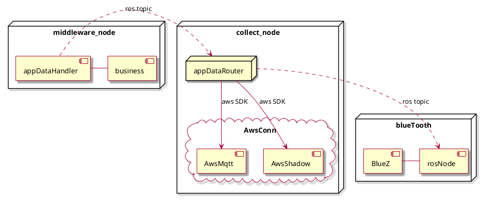
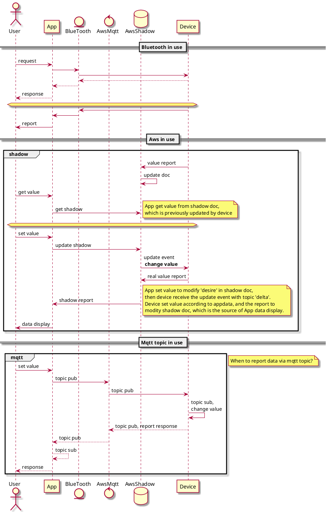
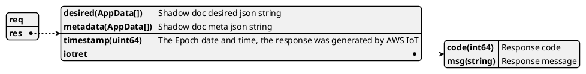
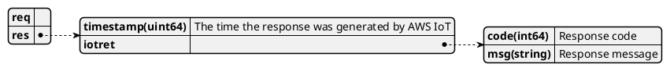
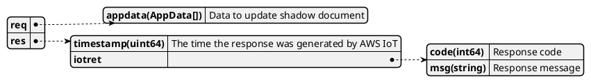
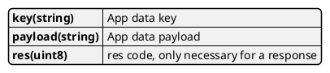
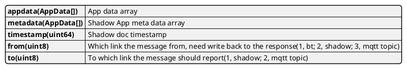
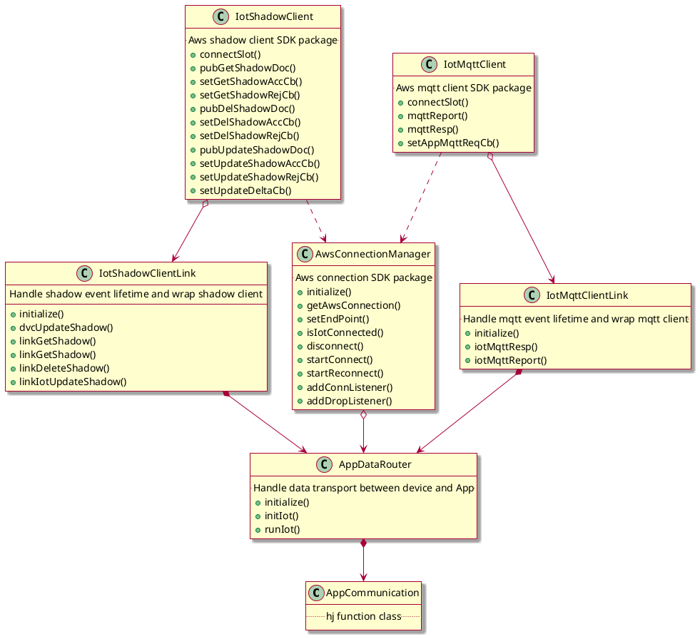
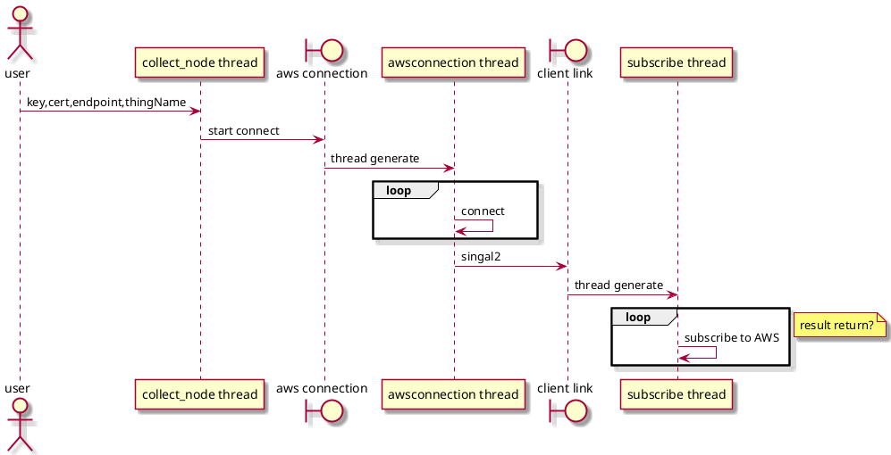
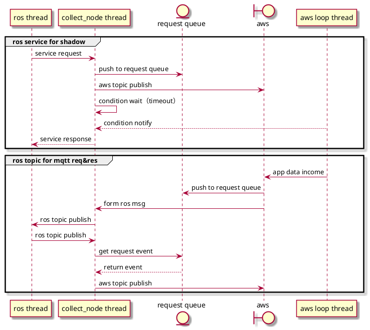

### Iot 通信模块梳理

#### 模块边界

#### 通信模型

#### 通信接口
##### ros接口
| topic/service    | ros service/msg |  type    |paraphrase | data direction 
|------------------|-------|---------|-----------|---------------------------
| /IotGetShadow    | IotShadow |Service|  Get Aws shadow document| device->aws
| /IotDeleteShadow | IotShadow|Service|  Delete Aws shadow document | device->aws
| /IotUpdateShadow | IotShadow |Service|  Update Aws shadow document reliably | devide->aws
| /ReqFromApp      | AppMsg |Topic    | Data request from APP | aws->device, bt->device
| /RespToApp       | AppMsg|Topic    | Data response for APP | device->aws, device->bt
| /ReportApp       | AppMsg|Topic    | Device daata report to APP | device->aws, device->bt

##### ros消息/服务
* service: IotShadow

getShadowDoc

deleteShadowDoc

updateShadow

* AppData

* AppMsg

#### 类图

* AppCommunication: 作为Function Iot的启动入口类，负责初始化Iot核心模块，同时负责解析middleware_node传来的appdata，进行Iot连接相关工作。
* AppDataRouter: 负责设备和App端的数据传递，承接ros接口和iot通讯接口之间的调用，主要职责是分发传递不同链路来的app数据。初始化时构建aws和蓝牙连接。
* AwsConnectionManager: Aws连接管理，单例类，提供aws连接的全局访问点。主要职责是完成和Amazon云连接的底层sdk调用，对外提供操作aws连接的相关接口。
* IotShadowClientLink: 对应用层提供操作aws shadow doc方法，同时对应用层请求的shadow服务事件进行管理。
* IotShadowClient: 与aws connection进行shadow相关的话题订阅,向IotShadowClientLink提供shadow相关事件的回调注册和操作shadow doc接口，是对底层aws sdk的封装。
* IotMqttClientLink: 对应用层提供基于mqtt topic的响应和上报方法，同时对来自mqtt topic的请求的和应用层的响应进行一一对应。
* IotMqttClient: 与aws connection进行mqtt自定义topic相关的话题订阅,向IotMqttClientLink提供来自App请求事件的回调注册和回复、上报App的方法，是对底层aws sdk的封装。

#### 线程模型
* iot连接

* iot通讯

#### TODO
* 蓝牙模块接入
* 输出连接状态上报接口
* 长时间不用app，不上报实时数据(mqtt topic)