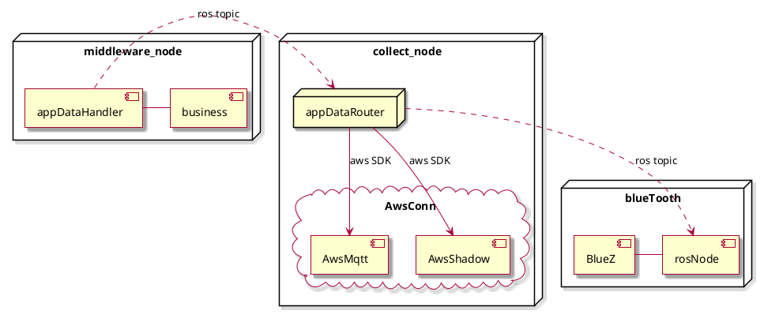
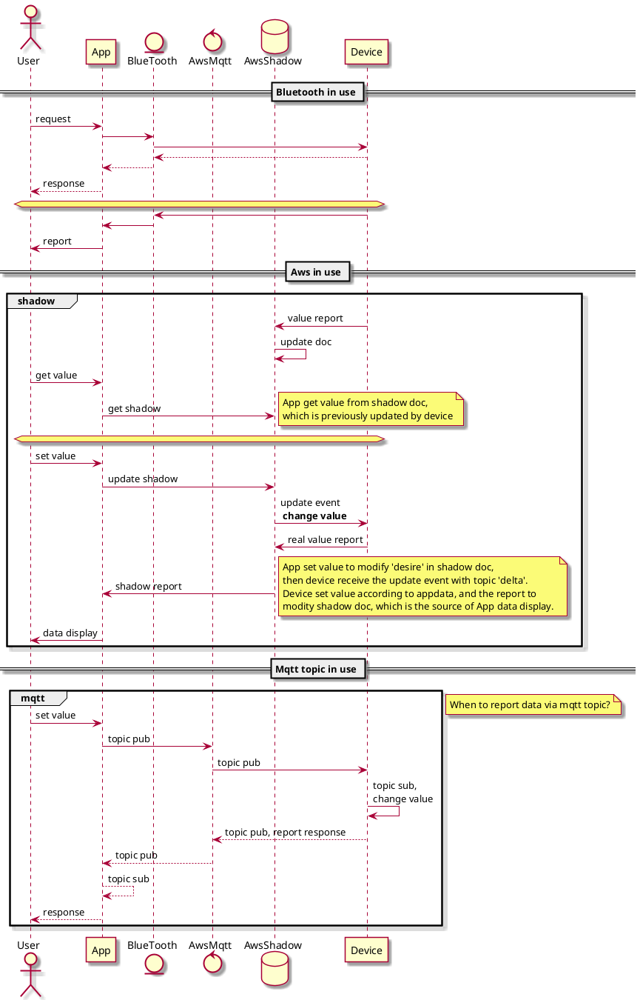
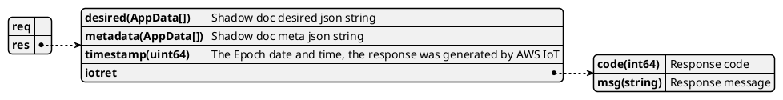
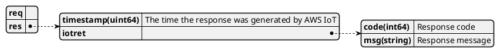
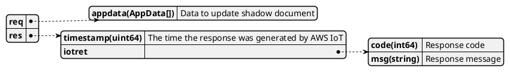
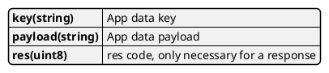
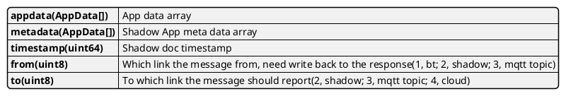

### Iot 通信模块

#### Shadow
影子(Shadow)是亚马逊云服务(AWS)提供的一种通信服务，其本质也是一种MQTT通信协议。

影子为设备、应用程序和其它云服务提供可靠的数据存储以共享数据。它们允许设备、应用程序和其它云服务连接和断开连接，而不会丢失设备的状态。

当设备、应用程序和其他云服务连接到时 AWS IoT，它们可以通过设备的阴影访问和控制设备的当前状态。例如，应用程序可以通过更新影子来请求更改设备的状态。 AWS IoT 发布一条消息，指明对设备的更改。设备接收该消息，更新其状态以保持匹配，然后发布一条消息以指示其更新状态。Device Shadow 服务在相应的影子中反映该更新状态。应用程序可以订阅影子的更新，也可以查询影子以获取其当前状态。

当设备离线时，应用程序仍然可以 AWS IoT 与设备的影子进行通信。在设备重新连接时，它接收其影子的当前状态，以便它可以更新其状态以与其影子的状态匹配，然后发布一条消息以指示其更新状态。同样，如果应用程序脱机并且设备状态在其脱机时发生变化，则设备将影子保持更新状态，以便应用程序可以在设备重新连接时查询影子以获取其当前状态。

影子状态记录就是在Amazon云端维护一份json document, 设备离线期间app可以通过读取shadow doc来更新状态。

[Aws shadow 服务介绍](https://docs.aws.amazon.com/zh_cn/iot/latest/developerguide/iot-device-shadows.html)

[Aws shadow document](https://docs.aws.amazon.com/zh_cn/iot/latest/developerguide/device-shadow-document.html)

#### 模块集成

#### 通信模型

#### 通信接口
##### ros接口
| topic/service    | ros service/msg |  type    |paraphrase | data direction 
|------------------|-------|---------|-----------|---------------------------
| /IotGetShadow    | IotShadow |Service|  Get Aws shadow document| device->aws
| /IotDeleteShadow | IotShadow|Service|  Delete Aws shadow document | device->aws
| /IotUpdateShadow | IotShadow |Service|  Update Aws shadow document reliably | devide->aws
| /ReqFromApp      | AppMsg |Topic    | Data request from APP | aws->device, bt->device
| /RespToApp       | AppMsg|Topic    | Data response for APP | device->aws, device->bt
| /ReportApp       | AppMsg|Topic    | Device daata report to APP | device->aws, device->bt
| /AppOnline       |       |Topic | App online type | collect_node->other  node
##### ros消息/服务
* service: IotShadow

getShadowDoc

deleteShadowDoc

updateShadow

* msg:AppData

* msg:AppMsg

