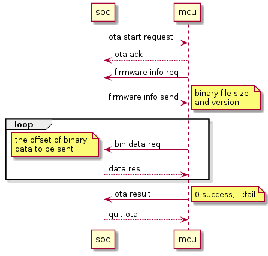
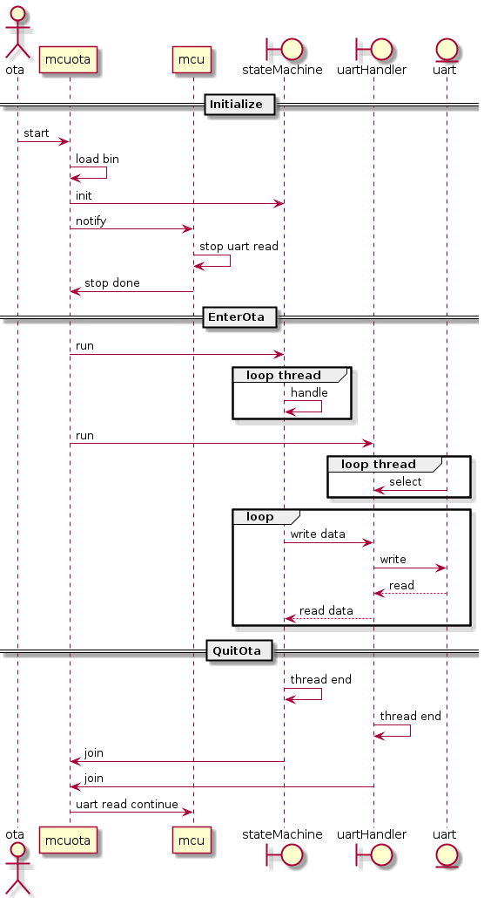
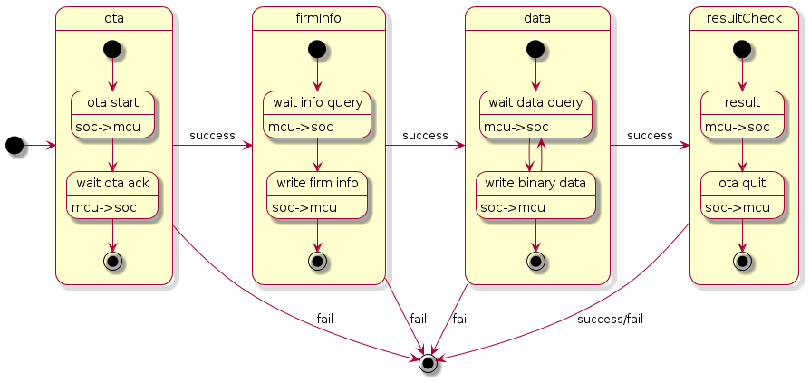

# mcuota

This project functions as ota module for Aiper X9 mcu and station.

## Document

#### MCU Ota交互逻辑


#### 执行逻辑


#### ota状态机逻辑


## Add your files

- [ ] [Create](https://docs.gitlab.com/ee/user/project/repository/web_editor.html#create-a-file) or [upload](https://docs.gitlab.com/ee/user/project/repository/web_editor.html#upload-a-file) files
- [ ] [Add files using the command line](https://docs.gitlab.com/ee/gitlab-basics/add-file.html#add-a-file-using-the-command-line) or push an existing Git repository with the following command:

```
cd existing_repo
git remote add origin http://192.168.140.12/platform/middleware/collect_node/mcuota.git
git branch -M main
git push -uf origin main
```

## Credits
Mcuota was written by panlou yzupl1995@163.com


## Project status
This project is still under development for final release.
