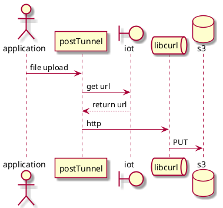
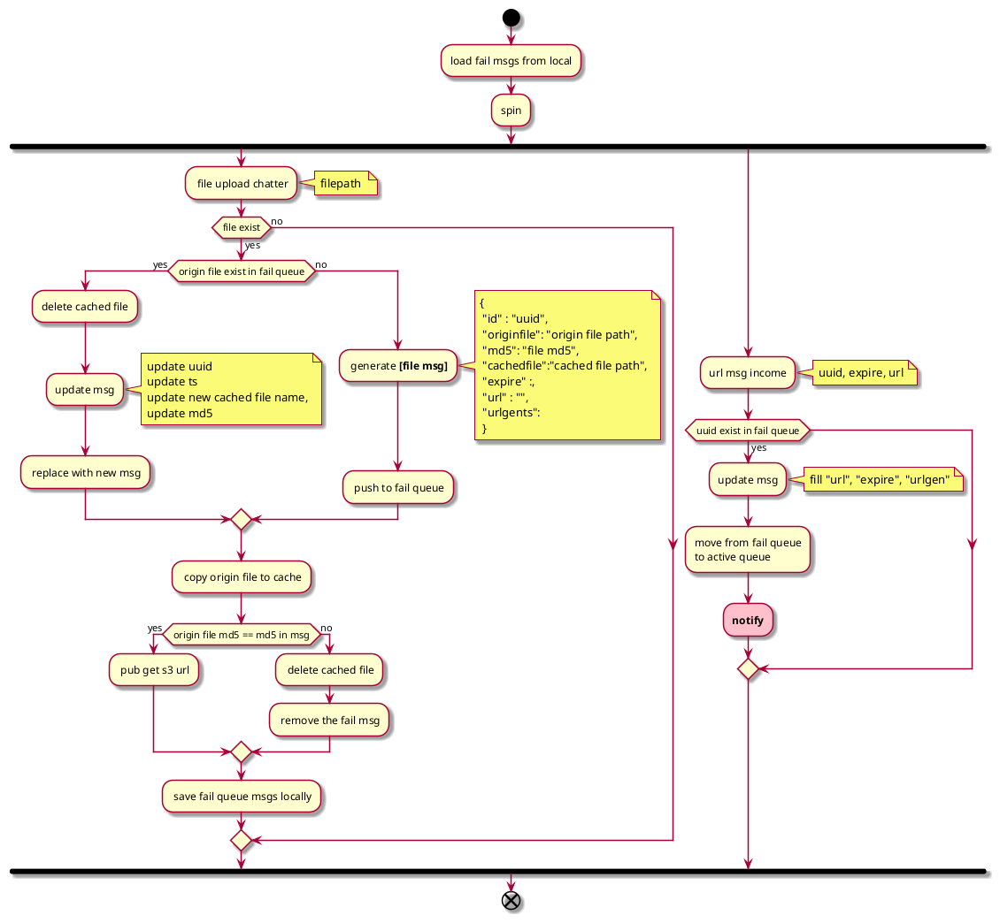
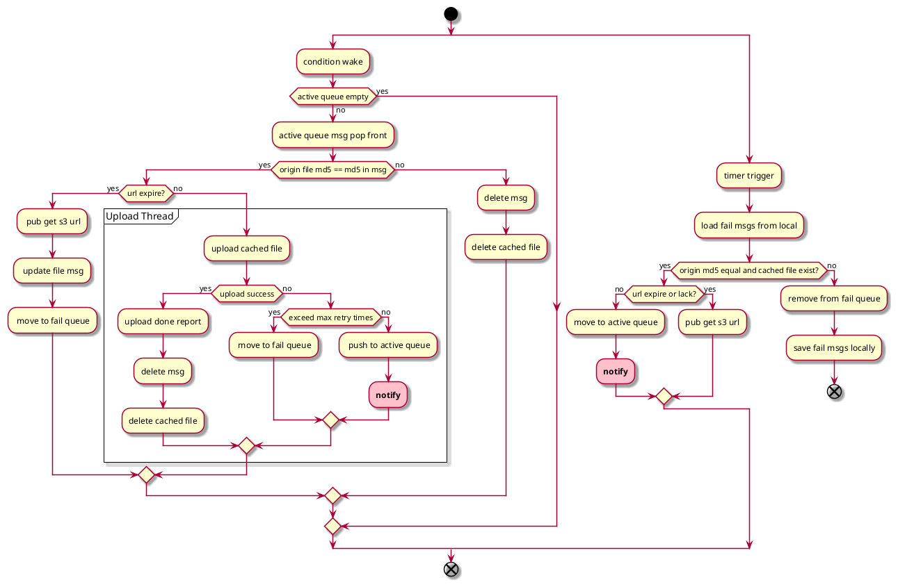

### postTunnel
 该模块功能向指定服务器上传业务设备文件，目前支持s3存储，涉及的文件包括地图数据，轨迹数据，清扫日志等。

#### 接口
rostopic:"/uploadfile/s3"
ros msg:
String : "filename (with absolute path)"

#### 基本时序


#### 协议
```json
//请求URL
{
  "uploadFileUrl":{
    "type":0,
    "uuid":"1234",
    "file":"map1-1716946233.json"
  }
}

//URL返回
{
  "uploadFileUrl":{
    "type":0,
    "uuid":"1234",
    "url":"xxxx",
    "urlExpire": 120
  }
}

//上传完成上报
{
  "uploadResultReport":{
    "type":0,
    "file":"map1-1716946233.json"
  }
}
```
#### 流程
##### 主业务流程


